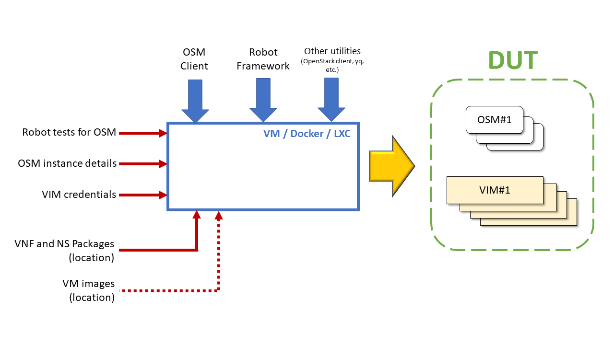

# README: Vagrant sandbox for Robot tests

Copyright 2020 Telefónica Investigación y Desarrollo S.A.U.
Licensed under the Apache License, Version 2.0 (the "License");
you may not use this file except in compliance with the License.
You may obtain a copy of the License at
    http://www.apache.org/licenses/LICENSE-2.0
Unless required by applicable law or agreed to in writing, software
distributed under the License is distributed on an "AS IS" BASIS,
WITHOUT WARRANTIES OR CONDITIONS OF ANY KIND, either express or implied.
See the License for the specific language governing permissions and
limitations under the License.

## HOW TO USE IT (TL;DR)

1. Prepare your local environment:
   1. Upload all required images to your VIM (e.g. `openstack image create ...`).
      - Hint: you can download first all relevant testing images from OSM by:
        ```bash
        cd images
        ./download_images.sh
        ```
   2. Add the corresponding VIM target to your OSM (`osm vim-create ...`).
2. Provide credentials for your VIM+OSM environment:
   - Create/Edit `localconfig/envconfig.rc` (and `localconfig/envprovisioning.sh` if needed).
     - HINT: First time, use `localconfig/TEMPLATE-envconfig.rc` and (if needed) `localconfig/TEMPLATE-envprovisioning.sh` as templates.
3. (OPTIONAL) In case you needed to apply a specific Devops patch-set, define it at `baseconfig/patchconfig.rc`.
4. Start the sandbox for its first time provisioning with `vagrant up`.
5. Do `vagrant ssh` to enter in the VM.
6. Run your first test:
   ```bash
   cd robot
   robot -d /vagrant/results testsuite/hackfest_basic.robot
   ```

**TIP:** In case your needed to use the latest version of OSM client from master instead of the latest stable version, simply do:

```bash
export OSM_CLIENT_VERSION=master
vagrant up
```

**Please use this option with caution, and only when absolutely required**.

## INTRODUCTION

This Vagrant sandbox provides a simple self-contained environment suitable for running consistently E2E tests with OSM.

Using this sandbox for local E2E testing has a number of advantages:

- It enables the end user to run and validate easily in your local environment the set of Robot tests available in ETSI OSM and enables you to contribute back more easily.
- It provides a well-known software environment, with all the required dependencies properly pre-validated.
- It guarantees that there are no hardcoded dependencies with the local tester environment or with OSM's CI/CD in terms of versions, destinations, paths, credentials, etc. All the test conditions can be completely defined using environment variables if needed.
- Its provisioner script (`provisioner.sh`) can be used as-is for provisioning other types of environments, such as a Docker containers.
- Likewise, the provisioner script can serve as documentation/validation of different installation processes maintained by OSM (client, Robot, etc.).

Here is the sandbox what Vagrant creates for you:



As it can be seen, the provisioning of the sandbox installs several pieces of software:

- OSM Client.
- Robot Framework and all library dependencies required to run the full test suite.
- Other complementary utilities to perform the tests or ease troubleshooting.

In addition, the provision of the sandbox requires a number of inputs:

- The collection of E2E Robot tests for OSM.
- Details of OSM instance(s) available for testing, part of the DUT.
- Details of VIM(s) available for testing, part of the DUT.
- Location of VNF and NS packages required to run the tests.
- Location of VM images required to run the tests (future use).

## PRE-REQUIREMENTS

### Available infrastructure (DUT)

- There is at least one VIM available and reachable.
- There is at least one OSM instance available and reachable.
- The OSM instance(s) has (have) at least one target added per VIM.

### Software pre-requirements already covered by Vagrant

- `authorized_keys` at `~/.ssh` with proper permissions.
- `id_rsa`, `id_rsa.pub` at `~/.ssh` with proper permissions.
- A functional `.gitconfig` file at `~` with proper permissions.
- Base configuration files at `${BASE_CONFIG_FOLDER}` (for Vagrant, `~/baseconfig`):
  - `seedconfig.rc`, where most basic configuration is made.
  - `patchconfig.rc`, where a Gerrit patch-set for Devops is selected. This file is optional.
- Local environment configuration files at `${LOCAL_CONFIG_FOLDER}` (for Vagrant, `~/localconfig`)
  - `envprovisioning.sh`, where local provisioning tasks are scripted. This file is optional.
  - `envconfig.rc`, where the DUT (VIM and OSM) are defined with environment variables.
- All packages required for the tests are already placed at `${PACKAGES_FOLDER}`.
  - In Vagrant, they are cloned into `/home/vagrant/packages/osm-packages` in the VM.
- All images required for the tests are already placed at `${IMAGES_FOLDER}`.
  - In Vagrant, `/vagrant/images`.
  - This folder is intended for future use, but not relevant for the current test suite.

### Software pre-requirements to be fulfilled by the user

Users **should edit** the information about the DUT (local VIM and available OSM) before provisioning the sandbox.

In the case of Vagrant, the `localconfig` sub-folder of the Vagrant sandbox definition (i.e. at the host) contains the relevant files to be edited:

1. `envprovisioning.sh` is used as "provisioner" to retrieve some the local environment data, i.e. it is a script intended to retrieve information from some well-known locations, such as local Git repos, that will be referred lated by `envconfig.rc`.
2. `envconfig.rc` contains the minimal set of environment variables required to run successfully the suite of Robot tests.

Once the vagrant sandbox is created, these files will be automatically copied into the VM to `${LOCAL_CONFIG_FOLDER}`) so that they can complete the configuration of the test environment.

## Configuration setup

### Tester setup and test suite configuration

Setup of testing conditions, independent from the local environment. This configuration is defined in two configuration files, stored at `${BASE_CONFIG_FOLDER}` (for Vagrant, `~/baseconfig`).

#### Base configuration: `seedconfig.rc`

This file contains common base configuration for the test suite, independent of the environment.

This repo provides a configuration customized for Vagrant sandboxes. If that is your case, please do not edit. However, the existing file can be used as template for creating a `seedconfig.rc` for other types of environments (e.g. Docker).

Hare is the sample of `seedconfig.rc` for Vagrant with the environment variables commented:

```bash
# Base folder for all operations
export BASE_FOLDER=/home/vagrant
# EOL account for SSH operations. Required for password-less operations with Git.
# Comment to undefine and it will use HTTP instead
export ETSIUSERNAME=$(git config user.name)
# Folder where Robot tests are stored
export ROBOT_DEVOPS_FOLDER="${HOME}/devops/robot-systest"
# Folder to save alternative DUT environments (optional)
export ENVIRONMENTS_FOLDER=environments
# Folder where all required packages are stored
export BASE_PACKAGES_FOLDER="${BASE_FOLDER}/packages"
export PACKAGES_FOLDER="${BASE_PACKAGES_FOLDER}/osm-packages"
# Folder where all required images are stored (intended for future use)
#export IMAGES_FOLDER="/vagrant/images"
# Folder where test results should be exported
export ROBOT_REPORT_FOLDER="/vagrant/results"
```

#### Devops patch configuration (optional): `patchconfig.rc`

This file, when exists, defines an optional Gerrit patch-set to be applied over the current Devops master.

This configuration is optional and mostly intended for OSM developers. Do not use if you plan to run community-approved test suites.

Here is the sample of `patchconfig.rc` with the environment variable commented:

```bash
# URL to be used in a subsequent `pull` command to apply the patchset
export DEVOPS_PATCH=refs/changes/51/8751/1
```

### DUT configuration (local environment)

Setup of the local environment for the tests. This configuration is defined in configuration files stored at `${LOCAL_CONFIG_FOLDER}` (for Vagrant, `~/localconfig`).

#### Local environment provisioning (optional): `envprovisioning.sh`

This file, which is optional, is intended to be used as a script to retrieve information about the local environment, which might include cloning repositories, downloading credential files, etc. Typically, this is used to fetch sensitive information. There are two typical cases:

- `openstack.rc`
  - The provisioner, besides fetching it, would append the info to `${LOCAL_CONFIG_FOLDER}/envconfig.rc`.
- `clouds.yaml`
  - The provisioner, besides fetching it, should copy the file to `${BASE_FOLDER}`.

Here is an example of `envprovisioning.sh` with relevant operations commented:

```bash
ssh-keyscan mygit.com >> ~/.ssh/known_hosts  # Often needed for non public repos
git clone git@mygit.com:local-environment-data/vim-and-infra.git
cp vim-and-infra/openstack/clouds.yaml "${BASE_FOLDER}"/ # Copy of credentials to base folder
```

#### Local environment configuration: `envconfig.rc`

This file, which is **mandatory**, is where the local DUT is completely defined with environment variables.

```bash
# VIM setup
export OS_USERNAME=username
export OS_PASSWORD=password
export OS_TENANT_NAME=projectName
export OS_AUTH_URL=https://identityHost:portNumber/v2.0
export OS_TENANT_ID=tenantIDString
export OS_REGION_NAME=regionName
export OS_CACERT=/path/to/cacertFile
# OSM location
export OSM_HOSTNAME="192.168.1.22"
# Details of the VIM target for OSM
export VIM_TARGET="vim002-fortville-physnet"
export VIM_MGMT_NET="management"
# Optional: location of alternative `envconfig.rc`-like files
export ENVIRONMENTS_FOLDER=environments
```

Alternatively, here is another example `envconfig.rc` where the VIM is defined with a credentials file, `clouds.yaml`:

```bash
# VIM setup
export CLOUDS_PATH=${BASE_FOLDER} # Location of `clouds.yaml`
export OS_CLOUD=vim-002
# OSM location
export OSM_HOSTNAME="192.168.1.22"
# Details of the VIM target for OSM
export VIM_TARGET="vim002-fortville-physnet"
export VIM_MGMT_NET="management"
# Optional: location of alternative `envconfig.rc`-like files
export ENVIRONMENTS_FOLDER=environments
```
